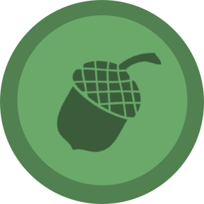

### 🚀 React Goal Tracker

<h1>Track your Goals with this handy little react app.</h1>

###### Goal Tracker

Create a list of your goals and personalise them under different tags that you yourself set up.

Don't worry about logging in or creating an account, this app will keep a track of your goals for you.

###### Technolgy

Using ReactJS as the front-end framework, generated using create-react-app and implementing styles thanks to the popular 3rd party styled-components library.

💅🏼 Styled-Components allows styles to be scoped to the individual component, generating unique classNames for your styles.

